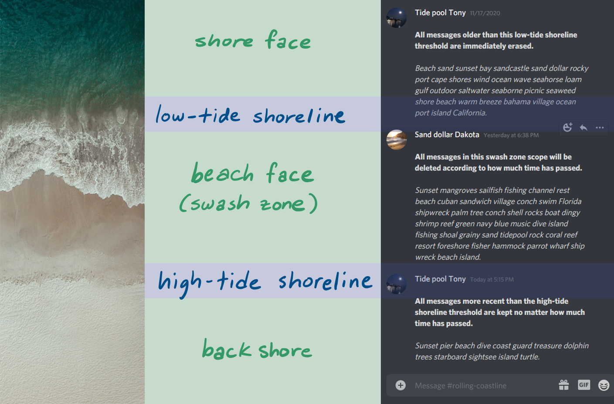

# Swashbot documentation

**Swashbot** is a Discord bot that washes messages away over time like [gentle beach waves](https://www.youtube.com/watch?v=b44ruhi5ji4).

Inspired by friends' privacy concerns about message permanence on Discord, in comparison to ephemeral messaging schemes (for instance, Signal's disappearing messages feature).

[**Swashbot documentation**](#swashbot-documentation)<br/>
&emsp;&emsp;[Installation](#installation)<br/>
&emsp;&emsp;[High-level behavior](#high-level-behavior)<br/>
&emsp;&emsp;&emsp;&emsp;[Zones](#zones)<br/>
&emsp;&emsp;&emsp;&emsp;[Commands](#commands)<br/>
&emsp;&emsp;[Low-level behavior](#low-level-behavior)<br/>
&emsp;&emsp;&emsp;&emsp;[Project structure](#project-structure)<br/>
&emsp;&emsp;&emsp;&emsp;[Working memory](#working-memory)<br/>
&emsp;&emsp;&emsp;&emsp;[Long-term memory](#long-term-memory)<br/>
&emsp;&emsp;&emsp;&emsp;&emsp;&emsp;[`memo`](#memo)<br/>
&emsp;&emsp;&emsp;&emsp;[Complexity analysis](#complexity-analysis)<br/>
&emsp;&emsp;&emsp;&emsp;&emsp;&emsp;[Space complexity](#space-complexity)<br/>
&emsp;&emsp;&emsp;&emsp;&emsp;&emsp;[Time complexity](#time-complexity)<br/>
&emsp;&emsp;[Planned updates](#planned-updates)<br/>
&emsp;&emsp;&emsp;&emsp;[Known bugs](#known-bugs)<br/>
&emsp;&emsp;&emsp;&emsp;[Potential future features](#potential-future-features)<br/>
[**EOF**](#eof)

## Installation

[^ Jump to top](#swashbot-documentation)

1. The only package required is `discord.py`:

  ```
  pip install -U discord
  ```

  Keep this up-to-date, as, in the past, Discord may change their rate limits.

2. Set up the following environment variables (see `config.py`):

  | Environment variable | Description                |
  |----------------------|:---------------------------|
  | `SWASHBOT_TOKEN`     | Client secret token        |
  | `SWASHBOT_DATABASE`  | Location of Swashbot's SQLite database (default `./swashbot.ltm`) |
  | `SWASHBOT_PREFIX`    | Bot prefix (default `~`)   |

  The only variable required is the **token**, don't forget it.

3. Run Swashbot:

  ```
  python run.py
  ```

## High-level behavior

[^ Jump to top](#swashbot-documentation)

With Swashbot, server moderators (specifically, users with the `Manage Channels` permission) can set how much time it takes messages in a channel to erase. In addition, Swashbot can be told to always keep a minimum amount of messages in the channel, as well as to maintain a maximum limit. These three degrees of freedom define three zones, explained below.

Due to Discord limitations, Swashbot cannot be used in private group DMs. A workaround might be to create a small server with one channel.

### Zones

[^ Jump to top](#swashbot-documentation)

Swashbot washes away messages in a channel according to three zones:

1. **Shore face**: This zone represents messages furthest into the past, or equivalently, furthest up in a channel's history. Swashbot deletes any messages reaching this zone, no matter how short of a time has passed. The limit of this zone is specified by defining the maximum amount of messages `m` allowed in the channel via the `~atmost m` command.
2. **Swash zone**: These messages are erased according to a set time. This expiration time `t` in minutes is set by the `~minutes t` command.
3. **Back shore**: The opposite of the shore face, this zone represents the most recent messages in a channel. Swashbot keeps these messages regardless of how much time has passed, until they enter the swash zone. The number of messages in the back shore `m` is set by the `~atleast m` command.



Credit for image on left side: [Alex Perez (@a2eorigins) via Unsplash](https://unsplash.com/photos/Iul_cHtH4NY)

### Commands

[^ Jump to top](#swashbot-documentation)

| Command & syntax | Description                                                  |
| :--------------: | :----------------------------------------------------------- |
| `~help`          | Provides a link to this documentation as well as a list of example commands. |
| `~stats`         | Displays some statistics since Swashbot logged in.           |
| `~current`       | Display current settings for the channel.                    |
| `~wave m`        | Wash away the last `m` messages. `~wave` without providing the `m` parameter defaults to washing away 100 messages. |
| `~atleast m`     | Always keep the `m` most recent messages in the channel. Defines the size of the [back shore](#zones). |
| `~atmost m`      | Keep the channel's message count at most `m` by deleting the oldest messages in the channel. Defines where the [shore face](#zones) begins. |
| `~minutes t`     | Any messages in the [swash zone](#zones) will be erased after `t` minutes. |

Note that values for `m` and `t` in the commands above also include `0` and `inf` (infinity).

To quickly reset a channel's settings, use `~atleast inf`, since this is essentially telling Swashbot to keep an infinite amount of messages in the channel.

## Low-level behavior

[^ Jump to top](#swashbot-documentation)

Swashbot is an instance of a class called `Swashbot` that inherits from [`discord.Client`](https://discordpy.readthedocs.io/en/latest/api.html#client).

### Project structure

[^ Jump to top](#swashbot-documentation)

* `cogs/` -- discord.py bot cogs
* `utils/` -- helper modules
* `config.py` -- place bot token here
* `main.py` -- main Swashbot code
* `run.py` -- run Swashbot

### Working memory

[^ Jump to top](#swashbot-documentation)

The most important variables Swashbot keeps track of are `memo` and `decks`.

* `memo` is a `LongTermMemory` object that keeps track of channels' settings.
* `decks` is a `dict` keyed by channel ID that keeps track of all messages within the swash zone and back shore in the channel by taking note of the message ID and message creation date.

### Long-term memory

[^ Jump to top](#swashbot-documentation)

In the case of Discord outages, updating code, and other script reboots, Swashbot has "long-term memory", which is a SQLite database file, to remember which channels it should be keeping track of. By default, the file is called `swashbot.ltm`.

In Swashbot's long-term memory, there is one table: `memo`.

The table stores server and channel IDs as `INTEGER` types. Note that since an `INTEGER` in a SQLite3 database is a *signed* 64-bit integer and thus may be at greatest `2**63 - 1 = 9223372036854775807`, we may want to figure out in what circumstances the [*unsigned* 64-bit integer channel and server IDs](https://discord.com/developers/docs/reference#snowflakes) might break this ceiling. According to the Discord documentation, the 42 most significant bits of the ID represent milliseconds since the first second of 2015 (Discord Epoch). Thus, IDs are expected to break the ceiling of a signed SQLite3 integer starting around `2**42 = 2199023255552` milliseconds since Discord Epoch, or around Wednesday, September 6, 2084. So, remind me to do something about that by then :ok_hand:

#### `memo`

[^ Jump to top](#swashbot-documentation)

|       `channel`       | `channel` |  `guild`  | `at_least` | `at_most` | `minutes` |
| :-------------------: | :-------: | :-------: | :--------: | :-------: | :-------: |
| `INTEGER PRIMARY KEY` | `INTEGER` | `INTEGER` | `INTEGER`  | `INTEGER` | `INTEGER` |

`at_least`, `at_most`, and `minutes` may be null, representing infinity.

`guild` is the ID of the server, and `channel` is the ID of the channel.

### Complexity analysis

[^ Jump to top](#swashbot-documentation)

Quantities to describe the space and runtime complexity:

| Quantity |                      Description                       |
| :------: | :----------------------------------------------------: |
|    n     |        Total number of servers Swashbot swashes        |
|   c_i    |    Number of channels Swashbot swashes in server i     |
|    c     |       Total number of channels Swashbot swashes        |
|   m_ij   |      Number of messages in channel j of server i       |
|    m     | Total number of messages Swashbot has to keep track of |

Note: O(n) ∈ O(c) ∈ O(m)

#### Space complexity

[^ Jump to top](#swashbot-documentation)

Since Swashbot keeps track of how many messages are in the back shore and swash zone, Swashbot's RAM space complexity is ϴ(m). There are ways to implement Swashbot's operations with a handful of ϴ(1)-size pointers & variables for ϴ(c) space, but with how I envision it, that would require less agile performance and more API requests.

Since Swashbot's long-term memory needs only to keep track of a channel's settings, and not any messages in the channels, the space of complexity of Swashbot's long-term memory is just ϴ(c).

#### Time complexity

[^ Jump to top](#swashbot-documentation)

|                           Operation, event, or command |                Time complexity                |
| -----------------------------------------------------: | :-------------------------------------------: |
|                                     Bot initialization |                     ϴ(m)                      |
|                               Washing away one message |                     ϴ(1)                      |
|           New non-command message appears in a channel |                     ϴ(1)                      |
| Message is deleted (by any client other than Swashbot) |                     ϴ(1)                      |
| Bulk message deletion (by any bot other than Swashbot) | Not yet implemented -- intended to be O(m_ij) |
|                           Swashbot removed from server |  Not yet implemented -- intended to be O(1)   |
|                                   `~atleast m` command |                 Ω(1), O(m_ij)                 |
|                                    `~atmost m` command |                 Ω(1), O(m_ij)                 |
|                                   `~minutes t` command |                 Ω(1), O(m_ij)                 |
|                                      `~wave m` command |                 Ω(1), O(m_ij)                 |

## Planned updates

[^ Jump to top](#swashbot-documentation)

### Known bugs

[^ Jump to top](#swashbot-documentation)

* What happens if two commands are sent within half a second of each other (e.g. worst case might be `~atmost inf` followed by `~atmost 0`)?
* Users *may* be able to get around the `Manage Channels` requirement by proxying via a webhook or bot. (Discord users who know what I mean by that will know what I mean by that.)
* When Swashbot is removed from a server, it doesn't (yet) automatically detect that. This isn't exactly fatal, but it's not elegant.
* When a bot bulk deletes messages in a channel, Swashbot doesn't (yet) refresh its `decks` variable appropriately. This isn't exactly fatal, but it's not elegant.

### Potential future features

[^ Jump to top](#swashbot-documentation)

* Cleaner error handling
* Fancy analytics: track and report errors in a smart & transparent way
* Make the bot more personable

# EOF

[^ Jump to top](#swashbot-documentation)